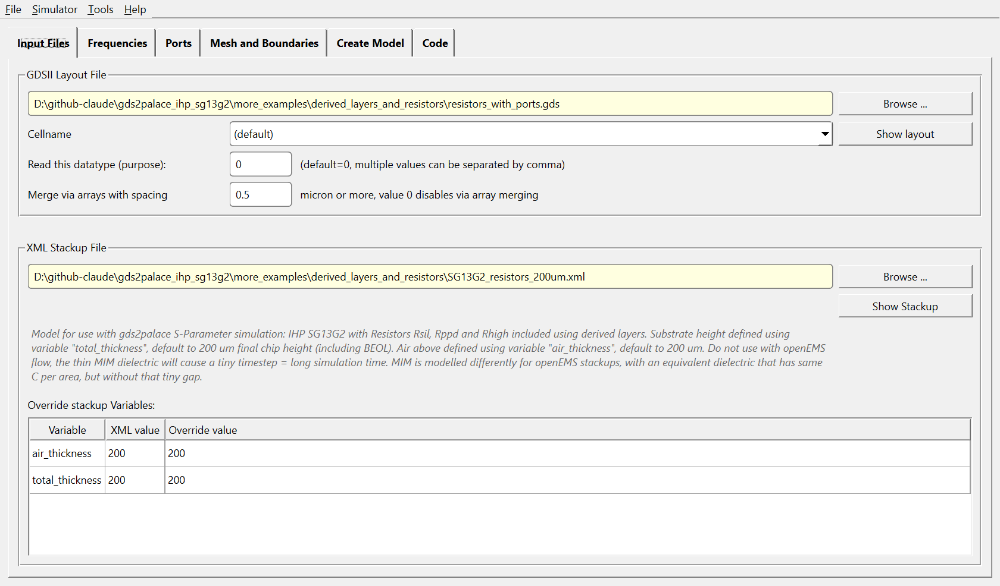
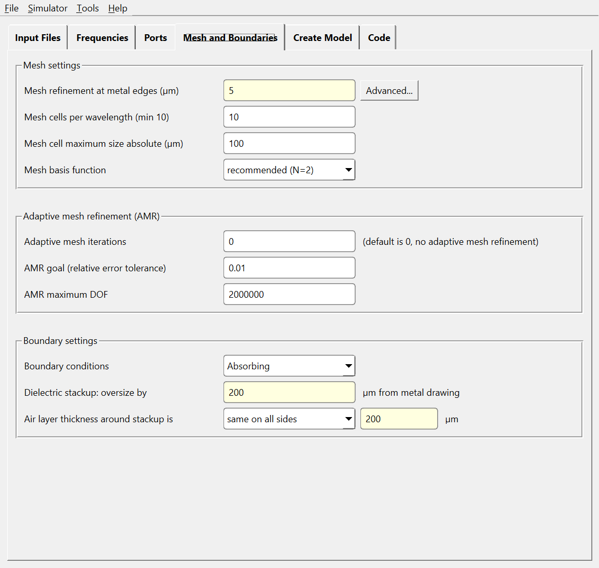
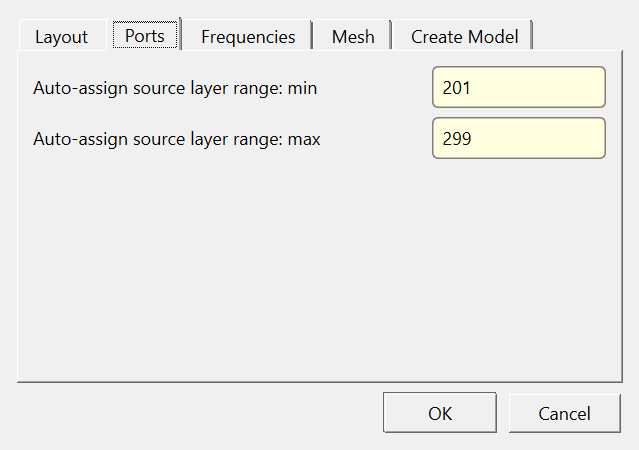
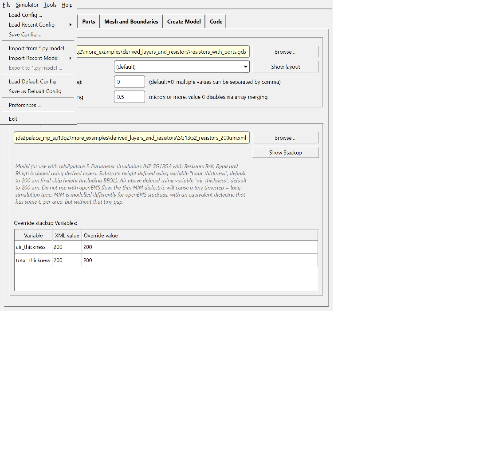

# setupEM and setupThermal User's Guide

Document version: 2026-09-01

## Contents
[Result Viewer and Model Fit](#result-viewer-and-model-fit)  
[What's New](#whats-new)  
[About setupEM and setupThermal](#about-setupem-and-setupthermal)  
[Installation](#installation)  
&ensp;[Installing setupEM](#installing-setupem)  
&ensp;[Installing the AWS Palace FEM solver](#installing-the-aws-palace-fem-solver)  
&ensp;[Installing Elmer FEM](#installing-elmer-fem)  
&ensp;[Missing libraries on Linux](#missing-libraries-on-linux)  
[Starting the applications](#starting-the-applications)  
[User interface overview](#user-interface-overview)  
[Input Files tab](#input-files-tab)  
&ensp;[Show Stackup](#show-stackup)  
&ensp;[File description and overriding stackup Variables](#file-description-and-overriding-stackup-variables)  
[Frequencies tab](#frequencies-tab)  
[Ports tab](#ports-tab)  
[Mesh and Boundaries tab](#mesh-and-boundaries-tab)  
[Create Model tab](#create-model-tab)  
[Result Viewer](#result-viewer)  
[Model Fit](#model-fit)  
[Code tab](#code-tab)  
[File menu](#file-menu)  
[Help menu and version check](#help-menu-and-version-check)  
[KLayout integration](#klayout-integration)  
[setupThermal](#setupthermal)  
&ensp;[Starting setupThermal](#starting-setupthermal)  
&ensp;[Differences from setupEM](#differences-from-setupem)  
&ensp;[Thermal Sources + Boundaries tab](#thermal-sources--boundaries-tab)  
&ensp;[Mesh tab](#mesh-tab-setupthermal)  
[The Stackup Editor](#the-stackup-editor)  
&ensp;[Launching the editor](#launching-the-editor)  
&ensp;[Variables tab](#variables-tab)  
&ensp;[Materials tab](#materials-tab)  
&ensp;[Dielectric Stack tab](#dielectric-stack-tab)  
&ensp;[Layers tab](#layers-tab)  
&ensp;[Derived Layers tab](#derived-layers-tab)  
&ensp;[Thermal Tables tab](#thermal-tables-tab)  
&ensp;[File Description tab](#file-description-tab)  
&ensp;[XML Preview tab](#xml-preview-tab)  
&ensp;[Converting between position formats](#converting-between-position-formats)  
&ensp;[Undo and Recent Files](#undo-and-recent-files)  
[See also](#see-also)  

## Result Viewer and Model Fit

setupEM includes two built-in tools for working with simulation results directly, without external scripts:

- **Result Viewer** (Create Model tab > **View Results...**) plots Touchstone S-parameter results — dB/phase, Smith chart, zoomed Smith chart — for one or many result files at once, right inside setupEM. See chapter "[Result Viewer](#result-viewer)".
- **Model Fit** (Create Model tab > **Model Fit...**) launches [snp2le](https://github.com/iic-jku/snp2le), an external open-source tool that extracts a lumped-element SPICE/Spectre netlist from S-parameter results — offering to install it via pip automatically if it isn't already present. See chapter "[Model Fit](#model-fit)".

## What's New

This chapter gives a brief overview of major features added since the previous edition of this guide. For the complete, dated change log, see [`CHANGES.md`](CHANGES.md).

- **A graphical Stackup XML Editor**, reachable from **Tools > Edit Stackup XML...** in both apps — see chapter "[The Stackup Editor](#the-stackup-editor)". It replaces hand-editing the stackup XML in a text editor, and covers Materials, Dielectric Stack, drawn and Derived Layers, Variables/expressions, and Thermal Tables.
- **setupThermal**, a companion app for building Elmer thermal simulation models the same guided way as setupEM builds Palace/Elmer EM models — see chapter "[setupThermal](#setupthermal)".
- **Overriding stackup Variables from the Input Files tab.** If the chosen XML file declares `<Variable>`s (e.g. `total_thickness`, `air_thickness`), an editable grid now lets you override their values for this run, without touching the XML file or the generated script — see "[File description and overriding stackup Variables](#file-description-and-overriding-stackup-variables)".
- **Start Simulation on Windows runs Palace directly and shows results automatically.** No more opening a terminal and typing `./run_sim` yourself - output streams live into the Log panel, Terminate actually works, and a results summary (degrees of freedom, simulation time, peak RAM, mesh-adaptation error indicators) appears automatically once a run finishes - see "[Create Model tab](#create-model-tab)".
- **Start Simulation now checks for leftover results from a previous run** before launching the solver, and offers to delete them (default) or keep them — see "[Create Model tab](#create-model-tab)".


## About setupEM and setupThermal

[gds2palace](https://github.com/VolkerMuehlhaus/gds2palace_ihp_sg13g2) enables an **RFIC FEM simulation** workflow where GDSII layout files are simulated using the [Palace FEM solver by AWS](https://awslabs.github.io/palace/stable/) or, as an alternative, [Elmer FEM](https://www.elmerfem.org/). **setupEM** provides a Python-based graphical user interface to configure and run this workflow, instead of writing the simulation model script by hand — and it can also start the simulation once the model is built.

**setupThermal** is the same kind of guided, tabbed interface as setupEM, but for building **steady-state thermal simulation** models with Elmer instead of S-parameter models. Both apps are installed together and share the same gds2palace workflow underneath, so a stackup XML file, once created, works with either if it has both electric and thermal materials parameters fully defined.

Installing setupEM/setupThermal installs the gds2palace workflow automatically. It does **not** install the actual solvers (AWS Palace, Elmer FEM) - those are separate installs, described below.

For the underlying workflow concepts (settings dictionary, port semantics, mesh strategy, adaptive frequency sweep, XML stackup format) in more depth than this GUI-focused guide covers, see the [gds2palace workflow user's guide](https://github.com/VolkerMuehlhaus/gds2palace_ihp_sg13g2/blob/main/doc/userguide_md_format/gds2palace_workflow_userguide.md) - setupEM/setupThermal generate exactly the kind of Python model script that guide documents by hand.

## Installation

### Installing setupEM

As a Python program using the Qt library, setupEM and setupThermal work on Linux, Windows, macOS and other platforms. Activate the Python venv you want to install into, then:

```
pip install setupEM
```

To upgrade later:

```
pip install setupEM --upgrade
pip install gds2palace --upgrade
```

This installs both `setupEM` and `setupThermal` as commands, plus `gds2palace` as a dependency.

### Installing the AWS Palace FEM solver

Installing setupEM does **not** install AWS Palace itself - it only creates the input files Palace needs. Palace can be installed via Apptainer/Singularity containers or built from source with the spack package manager; see:

- [Installing Palace using Apptainer](Installing_Palace_using_Apptainer.pdf)
- [Installing Palace using spack](Installing_Palace_using_Spack.pdf)

To start Palace from setupEM, a wrapper script **run_palace** is used - this is where you point to your actual Palace installation (a remote copy and remote simulation is also possible). A template is available in the gds2palace repository's `scripts` directory.

### Installing Elmer FEM

Elmer FEM (used by setupThermal, and optionally by setupEM in Elmer EM mode) is not distributed with setupEM and must be installed separately - see <https://www.elmerfem.org/>. gds2palace needs to find two Elmer command-line tools:

- **Windows:** set the environment variable `ELMER_HOME` to your Elmer install directory.
- **Linux/macOS:** make sure `ElmerGrid` and `ElmerSolver` are on your `PATH`.

### Missing libraries on Linux

If you see this error message when trying to run setupEM or setupThermal:

```
qt.qpa.plugin: From 6.5.0, xcb-cursor0 or libxcb-cursor0 is needed to load the Qt xcb platform plugin. qt.qpa.plugin: Could not load the Qt platform plugin "xcb" in "" even though it was found.
```

install the additional Qt libraries:

```
sudo apt update
sudo apt install libxcb-cursor0 libxcb-xinerama0 libxcb-xkb1 libxcb-icccm4 libxcb-image0 libxcb-keysyms1 libxcb-randr0 libxcb-render-util0 libxcb-render0 libxcb-shape0 libxcb-shm0 libxcb-sync1 libxcb-xfixes0 libxcb-xinput0 libxcb-xv0 libxcb-util1 libxkbcommon-x11-0
```

## Starting the applications

With the venv activated, simply type `setupEM` to start the S-parameter GUI:


Type `setupThermal` to start the thermal GUI instead - see chapter "[setupThermal](#setupthermal)".

## User interface overview

Both apps organize the workflow into tabs, guiding you through model setup and simulation. Behind the scenes, the GUI builds a Python model script for gds2palace, viewable and (auto-refreshing) editable on the **Code** tab.

Colors in the user interface: **yellow** input fields always require your attention; **white** fields can usually be left at their default values.

setupEM can build models for **either** solver: the **Simulator** menu (**Simulator > Palace FEM** / **Elmer FEM**) switches between them, changing the window title and showing/hiding solver-specific settings on the Mesh and Boundaries tab (adaptive mesh refinement settings for Palace; solver/MPI settings for Elmer). setupThermal always targets Elmer's thermal solver and has no Simulator menu.

## Input Files tab

On this tab, you configure the two input files every model needs:

- **GDSII layout file** - the geometry.
- **XML stackup file** - materials, dielectric stack, drawn (and derived) metal/via layers.

Both fields support drag & drop or the **Browse...** button.

Some layout pre-processing is defined here too: **Merge via arrays with spacing** merges nearby vias on `Type="via"` layers into one larger via box (speeds up meshing). Layouts with **polygons with holes/cutouts** need "Preprocess GDSII file" checked - this option only appears with an outdated gds2palace install; a current one handles cutouts natively.




### Show Stackup

The **Show stackup** button visualizes the chosen stackup and its material properties. Dielectric materials are color coded to show permittivity at a glance; metal layers show sheet resistance, thickness, and spacing to neighboring layers. Click any shape for its name, material, and z-position/thickness in a flyout.


Note that stackup XML files for Palace/Elmer FEM simulation differ in some details (e.g. MIM modeling) from the XML used for the openEMS flow - each is optimized for its own solver. Using an openEMS stackup here can cause meshing errors; using this FEM stackup for openEMS can slow simulation down.

### File description and overriding stackup Variables

If the chosen XML file has a `<!-- File description: ... -->` comment, it's shown as italic text right below the file path - a quick way to see what a stackup file is for without opening it.

If the file also declares `<Variable>`s with plain (non-computed) values - e.g. `total_thickness`, `air_thickness` - an editable **Override stackup Variables** grid appears right below the description, listing each Variable's name, its value as declared in the XML, and an editable Override value column. Change a value there to override it for this model, without hand-editing the XML file. Variables computed from other variables (`="=expression"` values, e.g. a `bulk_thickness` derived from `total_thickness`) are not listed, since they're meant to follow whatever they're computed from, not be pinned directly.

Overridden values flow into the generated model script as a `variable_overrides` dict passed to `stackup_reader.read_substrate()` - see the [XML stackup format doc](https://github.com/VolkerMuehlhaus/gds2palace_ihp_sg13g2/blob/main/doc/XML_stackup_format/XML_stackup_format.md) for the underlying `<Variables>` mechanism. The grid (and the description above it) stays hidden entirely for a file that doesn't declare any Variables.

## Frequencies tab

Configure the frequency range for simulation. Palace uses an **adaptive frequency sweep** by default, so a dense output sweep is built from a limited number of actual EM simulations; more frequency points still generally means more simulation time.

For **specific fixed frequencies**, use the "fpoint" field. To additionally **store the resulting fields to disk for Paraview visualization** at specific frequencies, use "fdump" instead. Both lists combine with the fstart/fstop/fstep sweep before simulation.


FEM simulation can't run at 0 Hz DC. If you set start frequency to 0, setupEM handles this behind the scenes: two low frequency points (10 MHz, 20 MHz) are simulated instead, and results are extrapolated to 0 Hz during postprocessing.

## Ports tab

Ports are created by drawing rectangles on special GDSII layers (see the [gds2palace documentation](https://github.com/VolkerMuehlhaus/gds2palace_ihp_sg13g2/blob/main/doc/gds2palace_workflow_userguide.pdf) for the exact layer/shape rules - in-plane ports use rectangles, via ports use zero-size lines). Each port needs its own source layer. On this tab, you map each source layer to a port number, direction, and target layer(s) - direction matters for polarity when multiple ports share a ground.

Make your settings in the upper part of the tab, then **Apply** to add/update the row in the port list below.


Palace doesn't use the port **voltage** parameter physically - setupEM repurposes it to mark whether a port is "active" during simulation. For the full S-matrix, every port needs non-zero voltage (all ports get excited in turn). Setting a port's voltage to zero skips its excitation, for faster total simulation time; the corresponding rows/columns in the output file are then padded with zeros instead of simulated.


## Mesh and Boundaries tab

Controls the mesh used for simulation, trading off accuracy against simulation time.

**Mesh refinement at the edges** (`refined_cellsize`) sets the mesh size along polygon edges. This is not a global lower bound on mesh size (unlike the IHP openEMS flow) - smaller geometry just gets a locally smaller mesh. 2-5 µm is a good starting point for most IHP SG13G2 models.

**In this FEM workflow, conductors use surface impedance on their side walls - there's no need to mesh into skin effect**, unlike the openEMS flow (`gds2openEMS`), where solid conductors are meshed and `refined_cellsize` partially controls skin-effect resolution. This lets the FEM flow use a much coarser mesh.



**Mesh cell maximum size absolute** works together with cells/wavelength - the smaller of the two wins. **Mesh basis function** should stay at "most accurate" (order 2) unless you specifically want a faster, less accurate run. **Adaptive mesh iterations** (AMR) is usually unnecessary if you're already using order 2 with a ~2 µm initial mesh - a fine initial mesh without AMR is typically faster than a coarse mesh plus AMR. When AMR iterations is non-zero, **AMR goal** (relative error tolerance) and **AMR maximum DOF** control when Palace stops refining - whichever of the two is hit first. Both have sensible defaults and rarely need changing.

The oversize of dielectrics from the drawn geometry, and the additional air layer around everything, are also set here - **both must be non-zero**, or meshing will fail.

When **Simulator > Elmer FEM** is selected (setupEM only), this tab additionally shows Elmer-specific settings (direct vs. iterative solver, optional MPI thread count) in place of the Palace-only adaptive mesh refinement group.

## Create Model tab

Specify the target directory for the generated Python model and simulation results, and a model name (defaults to the GDSII file's name, editable).

The buttons work top-down: **preview** the model geometry first, then **create the mesh** (and inspect it in the gmsh viewer if you like) - close the gmsh window after each step.


**Start Simulation** runs the solver: on Linux this starts Palace via script `run_sim` directly; on Windows it runs the same `run_sim` script inside the Windows Subsystem for Linux (WSL), automatically - no terminal window opens, and Palace's console output streams live into the Log panel below, the same as on Linux. This works for simulation directories on a LOCAL drive only - WSL cannot reach a network drive. **Terminate** stops a running simulation, including one running inside WSL on Windows.

If the output directory already holds results from a previous run, **Start Simulation** asks first whether to delete them or keep them (default: delete), so stale results don't linger alongside a rerun with different settings. Only the solver's own output is a deletion candidate - the mesh, `config.json`, and the run script that Create Mesh just wrote are never touched.


This needs a `run_sim` script configured as described in the [gds2palace documentation](https://github.com/VolkerMuehlhaus/gds2palace_ihp_sg13g2/blob/main/doc/gds2palace_workflow_userguide.pdf) (template in that repository's `scripts` directory); on Windows, the same requirement applies inside your WSL environment, e.g. `run_palace` needs to be reachable there via `PATH` (usually set up in `~/.profile`).

When a Palace simulation finishes, a **results summary** is appended to the Log panel automatically: degrees of freedom, mesh elements, simulation time, peak RAM, and the mesh-adaptation error indicators (Norm/Max/Mean), read from Palace's own `palace.json`/`error-indicators.csv` output. For a run using adaptive mesh refinement, this is a table with one row per refinement iteration.

To convert simulation results to Touchstone SnP format, use script `combine_snp` (see the `scripts` directory) - it scans your working directory and below, and supports both Palace and Elmer S-parameter output. This already runs automatically as the last step of `run_sim`.

## Result Viewer

Once you have Touchstone SnP results, click **View Results...** on the Create Model tab to open the built-in **Result Viewer** - no need to run the standalone `plot_snp.py` script by hand.


The Result Viewer recursively scans the target directory for `.sNp` Touchstone files and lists them in a tree, grouped by the folder each file came from - useful once a target directory accumulates results from several simulation runs. Check individual files to overlay them, or check/uncheck a whole run's group entry to select or deselect every file below it at once. **Include _dc files** / **Include _deembedded files** filter out the DC-extrapolated and de-embedded variants that `combine_extend_snp.py` creates alongside the raw result, so you can start with just the raw file and bring in the others only when needed.


Pick which S-parameters to plot from the S-Parameters grid, sized to the lowest port count among the currently checked files. The top plot shows dB magnitude, the bottom shows phase, for every checked file overlaid with its own color and line style and one shared legend below - checking files across several runs, or a whole run group, overlays all of them at once:


For reflection parameters (S11, S22, ...), the Display panel can switch to a **Smith chart** or a **zoomed Smith chart** instead of dB+phase - this replaces the whole plot area, since a Smith chart isn't meaningful for non-reflection (transmission) parameters, which are listed as excluded from that view instead of shown empty:


The matplotlib toolbar above the plot (pan/zoom/save as PNG) works as usual. A file with only a single simulated frequency point is marked with a dot instead of a line, since there's nothing to draw a line between.

Result Viewer can also run standalone, without the full setupEM GUI: `python result_viewer.py [target_dir]`, or via the `resultViewer` console script installed with the package.

## Model Fit

Click **Model Fit...** on the Create Model tab (next to **View Results...**) to extract a lumped-element netlist from the current run's S-parameter result, using [snp2le](https://github.com/iic-jku/snp2le) - an external, open-source tool, not part of setupEM.


If snp2le isn't installed, setupEM offers to install it for you via pip:


Choosing **Install** runs `pip install snp2le` in the Log panel and, once it succeeds, continues automatically - there's no need to click Model Fit a second time. Choosing **Cancel** instead logs the manual install command and the project link.

Once snp2le is available, Model Fit locates the raw (not `_dc`, not `_deembedded`) Touchstone result file for the current run and launches the snp2le GUI in that file's directory. snp2le's GUI has no command-line option to preload a file, so the exact path is printed to the Log panel - load it via snp2le's own file picker:


If no raw result file exists yet (no simulation has been run), Model Fit shows a warning instead of starting snp2le - run a simulation first.

## Code tab

The generated Python model script - what the GUI would otherwise ask you to write by hand. It refreshes automatically every time you switch to this tab, so it always reflects the current state of every other tab (including any Variable overrides on the Input Files tab). This does mean any manual edit made directly in this text box is lost the next time you leave and return to the tab, so treat it as a live preview, not a place to hand-patch the script.


Use **File > Export to \*.py model** to save the current code to disk without running it (only available while this tab is active). The Create Model tab's Preview/Create Mesh/Start Simulation buttons also save the script to the target directory before running it.

## File menu

Save and load simulation configurations (JSON, extension `.simcfg` for setupEM / `.tsimcfg` for setupThermal), including a "Default Config" configuration (stored in your home directory) that's reloaded independently of any project. You can also drag & drop a `.simcfg`/`.tsimcfg` file onto the main window to load it, instead of using **Load Config ...**.

**Load Config ...** and **Import from \*.py model ...** each have a **Recent** submenu right below them, listing your last 10 files of that kind for quick reopening; saving a config file adds it to that list too. Use "Clear Recent Files" in either submenu to reset it.

**Import from \*.py model** loads settings from existing model code (e.g. the examples in the gds2palace repository), by detecting known keywords with or without the `settings[...]` dict syntax - this also works for openEMS Python models, though you'll likely need to adjust `refined_cellsize` afterward (openEMS models the MIM differently and typically needs a finer mesh).

**Preferences ...** changes the built-in defaults that a brand-new/blank field starts out showing (e.g. fstart/fstop, mesh refinement, dielectric oversize margin, the Ports tab's auto-assign source layer range, the Palace tab's AMR goal/maximum DOF) - saved per-user via Qt's settings mechanism, separate from any project's `.simcfg`/`.tsimcfg` file and from "Save as Default Config".






## Help menu and version check

Links to relevant documentation. **Help > Version Information** shows your installed **gds2palace** and **setupEM**/**setupThermal** versions alongside the latest available on PyPI.


To upgrade both to the latest version:

```
pip install gds2palace --upgrade
pip install setupEM --upgrade
```

## KLayout integration


setupEM can be launched directly from **KLayout** through a helper script:

<https://github.com/VolkerMuehlhaus/setupEM/blob/main/src/scripts/klayout_setupEM.py>

### Linux

Download `klayout_setupEM.py` somewhere, e.g. `~/scripts`, then start KLayout with:

```bash
#!/bin/bash
/usr/bin/klayout -e -rm ~/scripts/klayout_setupEM.py $1 $2 $3
```

A new menu item then appears: **Tools > setupEM**.

### Windows desktop shortcut

1. Right-click → **New → Shortcut**
2. Set target:

```text
"<Path to KLayout>\klayout_app.exe" -e -rm "<Path to script>\klayout_setupEM.py"
```

3. Name it, e.g., **setupEM via KLayout**.

## setupThermal

### Starting setupThermal

With the venv activated, type `setupThermal`. It uses the same gds2palace stackup workflow as setupEM, so layout and stackup files work identically - AWS Palace is not used/required for thermal models.

### Differences from setupEM

setupThermal reuses the same **Input Files**, **Mesh**, **Create Model**, **Code**, and **File** menu machinery as setupEM (everything described above applies unchanged - including the Variable overrides grid and Recent Files menus), with these differences:

- No **Frequencies** tab and no **Simulator** menu - a thermal model is a single steady-state solve, not a frequency sweep, and always targets Elmer.
- The **Ports** tab is replaced by **Thermal Sources + Boundaries** (see below).
- The Mesh tab omits the Palace-only adaptive mesh refinement group and any Palace/Elmer solver switch (always Elmer).

### Thermal Sources + Boundaries tab

Instead of ports, a thermal model needs **heat sources** and **constant-temperature boundaries**, defined the same structural way ports are in setupEM: draw marker polygons on dedicated GDSII layers, then map each one here.

For each thermal object, specify:
- **Geometry on layer number** - the GDSII layer the marker polygon is drawn on.
- **Target layer for thermal object** - which stackup layer it applies to.
- **Thermal source or const temp?** - `source` (a heat-dissipating polygon, e.g. an active device) or `constanttemp` (a fixed-temperature boundary, e.g. a heatsink or chip edge).
- **Thermal power source (W)** - dissipated power, for `source` objects.
- **Constant temp. boundary (K)** - fixed temperature, for `constanttemp` objects.

Apply each entry to the list below, the same way ports are added in setupEM's Ports tab.


A model needs **both** a source and a constant-temperature boundary to be solvable - heat has to enter somewhere and leave somewhere.

### Mesh tab (setupThermal)

Same **Mesh refinement at the edges** / **Mesh cell maximum size absolute** / basis function order controls as setupEM's Mesh and Boundaries tab, minus the Palace-specific adaptive mesh refinement settings - a steady-state thermal solve doesn't sweep frequency, so there's nothing to adapt against. Also, no air material around the stackup.

## The Stackup Editor

The Stackup Editor is a standalone graphical tool for creating and editing the XML stackup files used throughout this workflow - materials, the dielectric stack, drawn metal/via layers, derived layers, named Variables, and thermal conductivity tables. It replaces hand-editing this XML in a text editor.

Edits appear live in the cross-section preview. Clicking a shape there selects the matching row in the Dielectric Stack/Layers tables (and vice versa), and shows its properties in a flyout. The editor closes itself automatically if a different stackup file is chosen in the main app and there's nothing unsaved to lose.

### Launching the editor

From either app: **Tools > Edit Stackup XML...**. Standalone (no gds2palace model/simulation setup involved), run `stackupEditor` from a terminal with the venv activated, optionally with a filename: `stackupEditor mystackup.xml`.

### Variables tab

The first tab, appearing before Materials. A `<Variable>` has a **Name**, a **Value** (a plain literal, or an `=expression` referencing other variables), and an optional **Type** (number/string, usually left on "(auto)"). The **Resolved Value** column is read-only and computed live, showing what an expression actually evaluates to right now - a typo or a circular reference is obvious immediately, instead of only failing later at Save.


Typing `=` into any numeric-capable cell on the other tabs brings up an autocomplete list of declared Variables. This is the mechanism behind the Input Files tab's "Override stackup Variables" grid described earlier: a value like `total_thickness` used as `Thickness="=total_thickness"` elsewhere in the file can be overridden from the GUI without touching the XML, and every expression that depends on it follows automatically.

### Materials tab

Defines every material used by the stackup: name, type (conductor/dielectric/semiconductor/resistor), electrical properties (conductivity, permittivity, loss tangent), color (used by the cross-section preview and by `gds_viewer`), and - for thermal simulation - either a constant **Thermal Conductivity** or a **Thermal Table** reference (see "[Thermal Tables tab](#thermal-tables-tab)" below). Neither thermal setting is used by EM-only simulation.


### Dielectric Stack tab

Defines the vertical dielectric layer stack. Either the legacy stacking order (each dielectric's Thickness stacks it on the previous one) or Reference-relative positioning (a Dielectric names another Dielectric's top/bottom edge to sit against, with an offset) - see "[Converting between position formats](#converting-between-position-formats)". Read-only "(resulting)" columns show the resolved absolute Zmin/Zmax either way.


### Layers tab

Defines the drawn metal/via layers: GDSII layer number, material, and Zmin/Zmax (absolute, or Reference-relative the same way Dielectrics can be). This is what gives every layer its 3D position and material for meshing.


### Derived Layers tab

Some simulation layers don't exist as drawn GDSII geometry - they need to be computed from other layers, e.g. an on-chip resistor recognized as "poly AND implant AND NOT contact". This tab defines these as boolean operations (AND/OR/XOR/NOT/SIZE) on other GDSII or derived layer numbers. See [`derived_layers.md`](https://github.com/VolkerMuehlhaus/gds2palace_ihp_sg13g2/blob/main/doc/XML_stackup_format/derived_layers.md) for the full operation reference. Using Derived Layers (like Reference-relative positioning) requires `schemaVersion="3.0"` or newer.


### Thermal Tables tab

For materials whose thermal conductivity changes meaningfully with temperature (e.g. silicon substrate), a fixed constant isn't accurate enough. This tab is a master/detail view: the top grid lists every named `<Table>` (with a live point count), and selecting one shows its individual Temperature (K) / Value (W/(m·K)) points below. A Material's **Thermal Table** column (on the Materials tab) then references a table by name - it can also hold an `=variable` expression, e.g. to switch between a literature and a measured dataset by overriding one Variable, with no XML edit at all.

Points don't need to be entered in temperature order - they're sorted ascending automatically when the file is saved, since Elmer reads them as a piecewise-linear lookup curve.


### File Description tab

A free-text description stored as a `<!-- File description: ... -->` XML comment, shown on the Input Files tab of setupEM/setupThermal (see "[File description and overriding stackup Variables](#file-description-and-overriding-stackup-variables)") so a stackup file is self-documenting without opening it in the editor.


### XML Preview tab

A read-only, syntax-highlighted view of the file exactly as it will be saved - including the automatic `schemaVersion` bump and comment stamping this format uses when a file starts using Reference-relative positioning, Derived Layers, or Variables/expressions for the first time. It refreshes when you switch to it, and also right after Undo, New, Open, Import, or a format conversion.


### Converting between position formats

**Tools > Convert to Reference position format** rewrites an absolute-position stackup (Zmin/Zmax everywhere) to Reference-relative positioning in place - physical layer positions are unchanged, only how they're expressed in the file. The reverse, **Tools > Convert to legacy format**, resolves everything back to absolute positions and strips Reference/Variables/Derived Layers/Thermal Tables content that the legacy `schemaVersion="2.0"` format can't represent - you'll be asked to confirm, since this is lossy for those features.

Files using Reference-relative positioning or Derived Layers require `schemaVersion="3.0"` or newer; files using Variables/`"="`-expressions require `schemaVersion="3.1"`. The editor bumps this automatically and stamps a comment noting the minimum reader version needed, the first time you save a file that uses one of these features.

### Undo and Recent Files

**Edit > Undo** steps back through your edit history for the currently open file. **File > Open Recent** lists your last opened/saved stackup files for quick reopening, with a "Clear Recent Files" option - shared across setupEM, setupThermal, and standalone `stackupEditor` launches, since they all edit the same kind of file.

## See also

- [gds2palace workflow user's guide](https://github.com/VolkerMuehlhaus/gds2palace_ihp_sg13g2/blob/main/doc/userguide_md_format/gds2palace_workflow_userguide.md) - the underlying Python workflow this GUI generates code for, in full depth (settings reference, port semantics, mesh strategy, Elmer EM/thermal specifics, examples).
- [XML stackup format reference](https://github.com/VolkerMuehlhaus/gds2palace_ihp_sg13g2/blob/main/doc/XML_stackup_format/XML_stackup_format.md) and [evolution of the stackup file format](https://github.com/VolkerMuehlhaus/gds2palace_ihp_sg13g2/blob/main/doc/XML_stackup_format/evolution_of_stackup_file_format.md) - what every attribute means, and why the format grew the way it did.
- [`CHANGES.md`](CHANGES.md) - the dated change log for setupEM/setupThermal.
